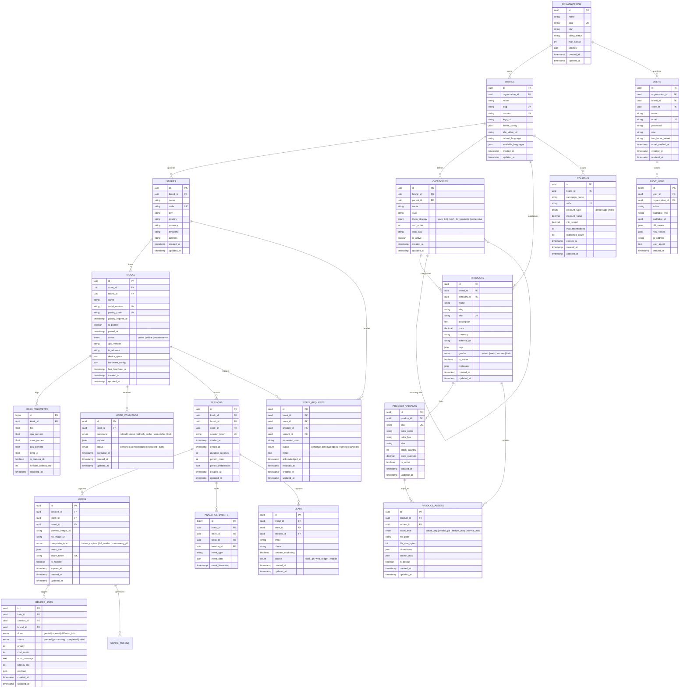

# Database Schema: AI Virtual Try-On Kiosk

## 1. Entity Relationship Diagram (Mermaid ERD)



---

## 2. Key Data Structures (JSON Schemas)

### 2.1 Product Asset `anchor_map`
Specifies exact MediaPipe landmark mappings for the 2D warp or 3D alignment engine:
```json
{
  "category": "tops",
  "anchors": {
    "left_shoulder": { "landmark_id": 11, "uv": [0.22, 0.18] },
    "right_shoulder": { "landmark_id": 12, "uv": [0.78, 0.18] },
    "left_hip": { "landmark_id": 23, "uv": [0.28, 0.85] },
    "right_hip": { "landmark_id": 24, "uv": [0.72, 0.85] },
    "neck_center": { "landmark_id": 0, "uv": [0.50, 0.15], "virtual": true }
  },
  "scaling": {
    "reference_width_ratio": 1.25,
    "vertical_slack_ratio": 1.10
  },
  "occlusion": {
    "mask_arms": true,
    "mask_hair": true,
    "tuck_mode": "untucked"
  }
}
```

### 2.2 Kiosk `hardware_config`
Local runtime controls dispatched remotely:
```json
{
  "camera": {
    "device_id": "default",
    "target_fps": 60,
    "preferred_resolution": { "width": 1080, "height": 1920 },
    "mirror_mode": true,
    "exposure_mode": "auto"
  },
  "display": {
    "orientation": "portrait",
    "fullscreen_on_boot": true,
    "idle_timeout_seconds": 60
  },
  "audio": {
    "volume_percent": 75,
    "voice_prompts_enabled": true
  },
  "peripherals": {
    "thermal_printer_enabled": false,
    "pir_motion_wake": true
  }
}
```
